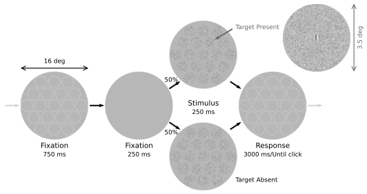

# Supraoptimal Visual Search with Heuristic Decision Rules

## Table of Contents

1. experiment: psychophysical data of human participants in detection and search tasks.
2. analysis: descriptive statistics at each target location in detection and search tasks.
3. simulation: ideal and heuristic searchers.

## Function / Purpose

This repository is a summary of my research project under the supervision of Dr. Wilson Geisler. It provides optimal and sub-optimal model observers for searching a deterministic target in noise background.

<!---
## Reference
For more details of this project, welcome to read the corresponding peer-reviewed article:
--->

## Contact

Email: anqizhang@utexas.edu

LinkedIn: www.linkedin.com/in/anqi-work
