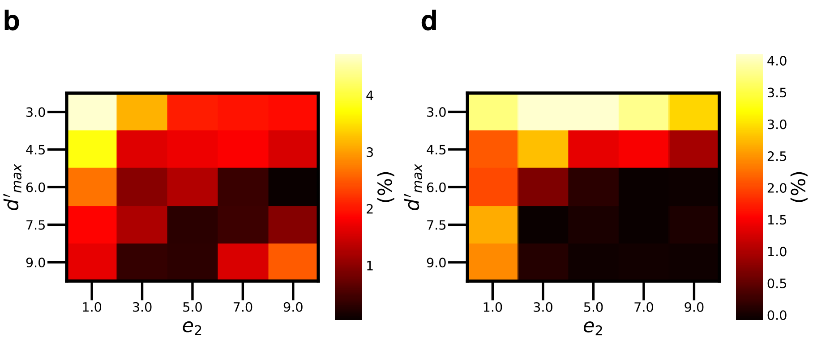
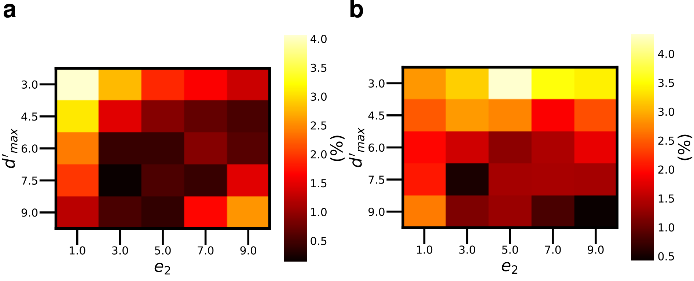

# Optimal Visual Search with Highly Heuristic Decision Rules

## Table of Contents

1. experiment: psychophysical data of human participants in detection and search tasks.
2. analysis: descriptive statistics at each target location in detection and search tasks.
3. simulation: ideal and heuristic searchers.

## Function / Purpose

This repository is a summary of my research project with Bill Geisler. It provides optimal and sub-optimal model observers for searching a deterministic target in noise background.

## Reference
Welcome to check out the corresponding article:
Journal of Vision April 2025, Vol.25, 5. doi:https://doi.org/10.1167/jov.25.4.5

> Main conclusion: in covert search, an observer can perform optimally even if it does not precisely estimate its own capacity of detecting a target.

## Correction

Heatmaps in Figure A4 need to be transposed:

So as for Figure A7:

## Contact

Email: anqizhang@utexas.edu

LinkedIn: www.linkedin.com/in/anqi-work
